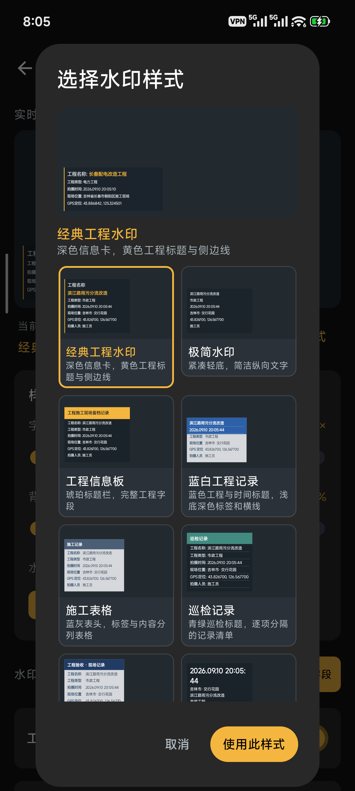
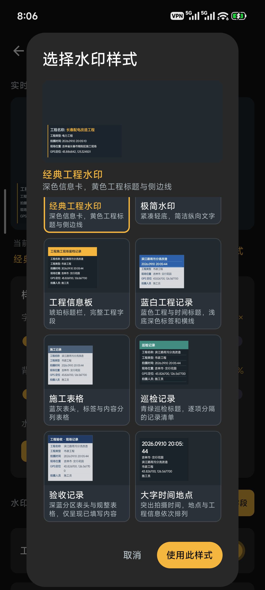
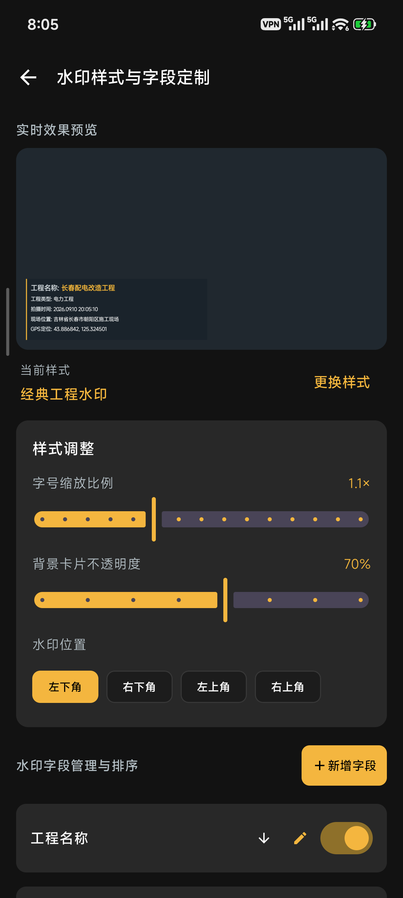
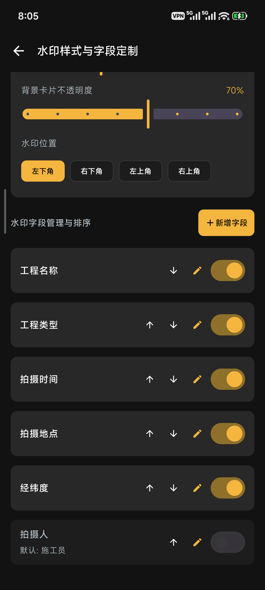
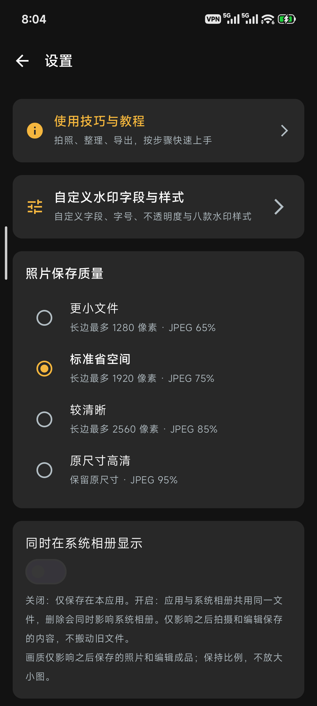
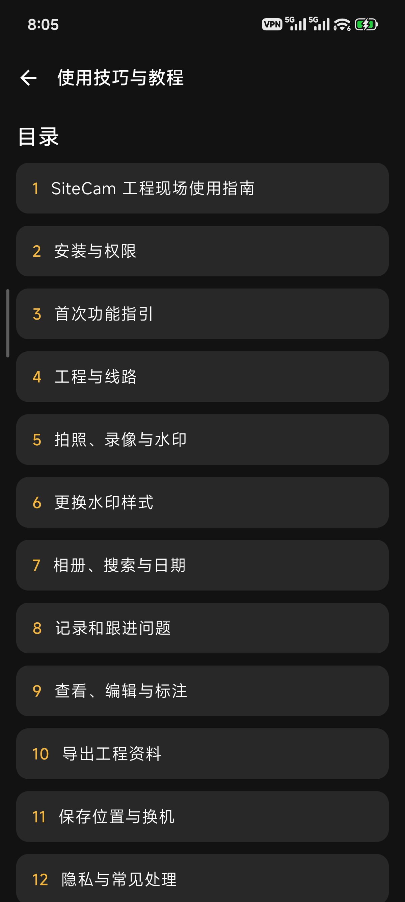
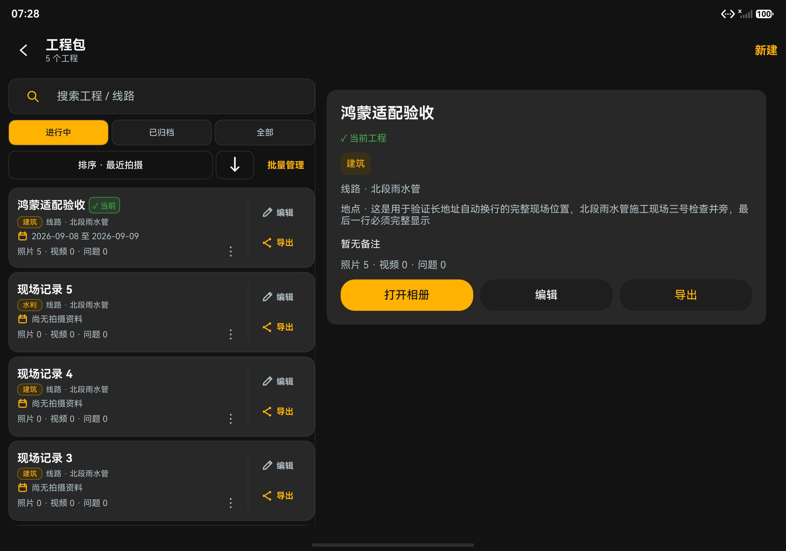

# SiteCam 工程水印相机

**拍好现场照片，整理好每个工程。**

📷 拍摄加水印　 ·　 🗂️ 按工程整理　 ·　 ✏️ 标记问题　 ·　 📦 一键导出

**免费 · 开源 · 无广告**

[⬇️ 下载安卓版 Release（推荐）](https://github.com/toydream525/SiteCam/releases/download/v0.3.0/SiteCam-0.3.0-Android-Release.apk)　
[🌐 官网](https://yuriaqua.com/sitecam/)　
[📖 使用说明](docs/USER_GUIDE.md)　
[💬 反馈问题](https://github.com/toydream525/SiteCam/issues)

默认下载 Release，推荐日常自用安装。[Debug 版](https://github.com/toydream525/SiteCam/releases/download/v0.3.0/SiteCam-0.3.0-Android-Debug.apk)供调试使用，采用独立包名，可与 Release 共存，数据分别保存。

---

## 📱 先看看实际界面

以下 **6 张截图来自小米手机上的 Android v0.2.9**，点击可放大。水印里的工程名称、地址和坐标是应用内置的演示内容，不是使用者的真实工程或当前位置。没有展示私人相册、账号或通知内容。

<table>
<tr>
<td align="center" width="33%"><b>🎨 选择喜欢的水印</b>   经典、极简、工程信息板等</td>
<td align="center" width="33%"><b>📋 巡检与验收也好用</b>   表格、巡检、验收、大字时间</td>
<td align="center" width="33%"><b>🔧 调整到合适的位置</b>   字号、底色深浅和四角位置</td>
</tr>
<tr>
<td align="center"><b>✍️ 想显示什么，自己选</b>   添加内容、开关显示、调整顺序</td>
<td align="center"><b>🖼️ 清晰度按需要选</b>   省空间或保留原尺寸，四档可选</td>
<td align="center"><b>📖 不会用？打开教程</b>   拍照、整理、编辑、导出都有说明</td>
</tr>
</table>

## 🧰 能帮你做什么？

| 现场工作 | 用 SiteCam 怎么做 |
| --- | --- |
| 📷 拍施工照片 | 自动加上工程名称、时间、地点等水印，支持拍照和录像 |
| 🗂️ 整理不同项目 | 按工程保存，支持搜索、分类、归档；编辑和导出入口直接可见 |
| 📅 找之前的照片 | 按日期、工程和问题状态筛选，还能批量移动和分享 |
| 🚩 记录现场问题 | 写下问题、标注轻重程度，跟进到处理完成 |
| ✏️ 给照片做说明 | 裁剪、旋转、画箭头、写文字、打马赛克，编辑后另存成品 |
| 📦 交付工程资料 | 导出压缩包或文件夹，带上照片、视频和资料清单 |

## 🚀 三步开始

**① 建工程** → 填工程名称，需要时补充线路和地点。 
**② 拍照片** → 选择水印，把发现的问题随手记下来。 
**③ 交资料** → 在工程或相册里选择导出，按需分享给同事。

详细操作见 [📖 使用指南](docs/USER_GUIDE.md)，应用的“设置 → 使用技巧与教程”里也能离线阅读。

## ⬇️ 下载哪个版本？

| 你的设备 | 当前状态 | 下载 |
| --- | --- | --- |
| 🤖 安卓手机 | **v0.3.0，可安装使用**，支持 Android 8.0 及以上 | [下载 APK](https://github.com/toydream525/SiteCam/releases/download/v0.3.0/SiteCam-0.3.0-Android-Release.apk) |
| 🌸 鸿蒙手机 / 平板 | **v0.2.8 开发版**，还不能作为普通真机安装包 | [开发包与说明](harmonyos/README.md) |
| 🍎 iPhone / iPad | 开发中，暂无安装包 | — |

**鸿蒙版说明：** 已完成部分手机和大屏界面验证，目前截图来自模拟器。签名、真实平板、折叠悬停和硬件视频还在等待验收。不要把开发包当作已经完成的正式版。

🌸 展开查看鸿蒙大屏界面（模拟器，非真机）

[查看详细进度与验证记录](harmonyos/VERIFICATION.md)

## 🔒 照片保存在哪里？

- 默认保存在应用内；卸载前，请先导出需要保留的资料。
- **安卓版**开启“同时在系统相册显示”后，两边共用同一份文件。系统相册删除后，应用也会同步隐藏；从系统回收站恢复后会重新显示。
- **鸿蒙版**的“另存到系统相册”会多存一份，两份互不影响。
- 不需要注册账号。定位和录音按需授权，拒绝定位仍可拍照，拒绝录音仍可录制无声视频。

## 🆕 最近更新

**v0.3.0：统一手机、折叠屏和平板布局，支持大屏相册双栏。** 竖屏快门在底部，横屏和方屏在右侧；小折叠外屏使用简化操作。

[查看全部更新](CHANGELOG.md) · [遇到问题？告诉我](https://github.com/toydream525/SiteCam/issues)

---

由 [ninjaaqua](https://github.com/toydream525) 开发 · [MIT 开源许可](LICENSE) 
想参与开发？查看 [开发说明](docs/DEVELOPMENT.md) · [开发进度](PROGRESS.md)

