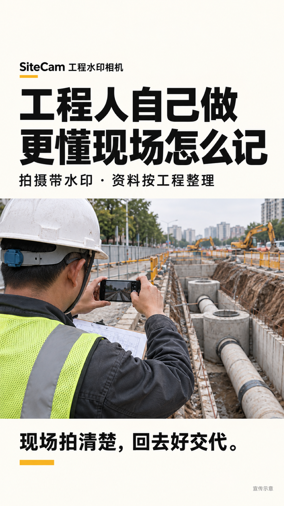
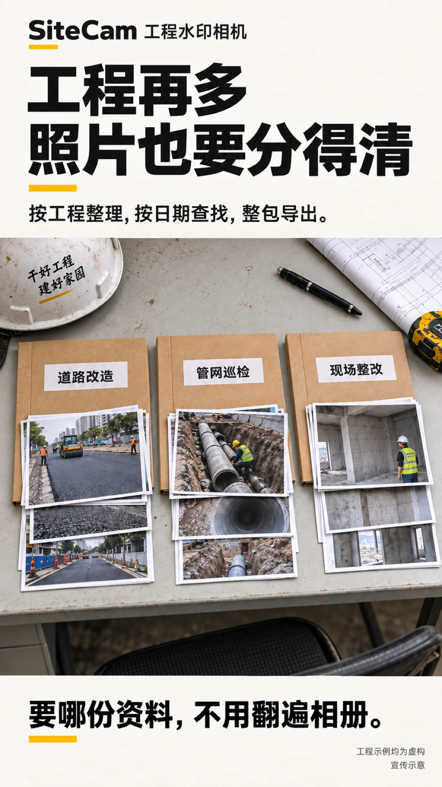
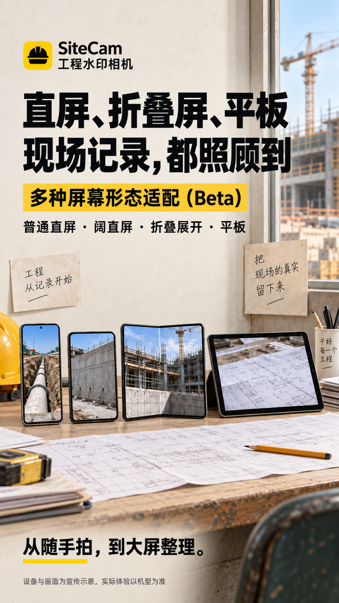
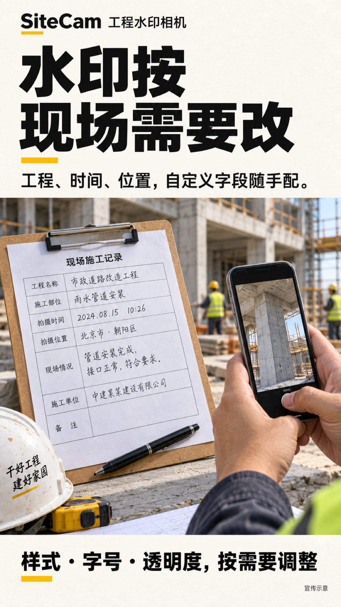
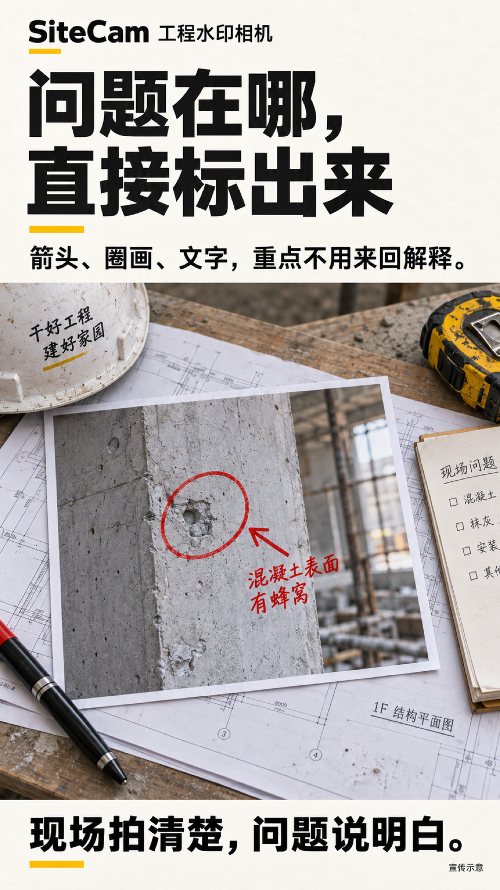
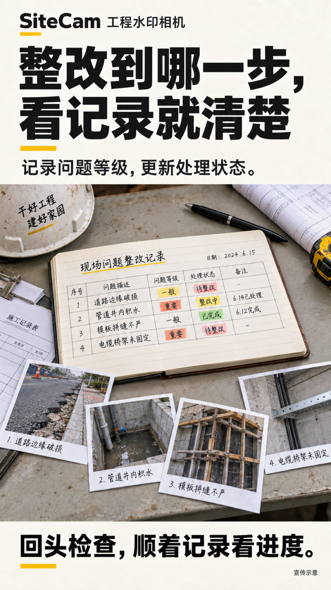
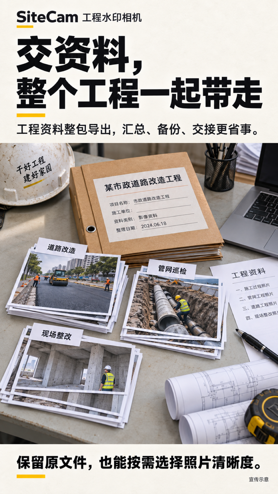

# SiteCam 工程水印相机

**工程人自己做，更懂现场怎么记。**

📷 拍摄加水印　 ·　 🗂️ 按工程整理　 ·　 ✏️ 标记问题　 ·　 📦 一键导出

📱 折叠屏、阔直屏和平板适配（beta）　 ·　 🌸 鸿蒙原生版 beta 已发布

**免费 · 开源 · 无广告**

[⬇️ 下载安卓版 Release（推荐）](https://github.com/toydream525/SiteCam/releases/download/v0.3.2/SiteCam-0.3.2-Android-Release.apk)　
[🌸 鸿蒙原生版 beta](harmonyos/README.md)　
[🌐 官网](https://yuriaqua.com/sitecam/)　
[📖 使用说明](docs/USER_GUIDE.md)　
[💬 反馈问题](https://github.com/toydream525/SiteCam/issues)

当前公开版本为 **v0.3.2（Android 版本号 15）**。默认下载 Android Release，推荐日常自用安装。

> **鸿蒙原生版 beta 已发布。公开 HAP 暂未签名，需要自行签名，鸿蒙版已提交华为应用市场审核，目前审核中；审核通过并上架后，可在商店下载。**

---

## 📱 功能介绍

工程现场的记录、整理与交付。以下为功能宣传示意。

<table>
<tr><td width="33%"></td><td width="33%"></td><td width="33%"></td></tr>
<tr><td width="33%"></td><td width="33%"></td><td width="33%"></td></tr>
<tr><td width="33%"></td></tr>
</table>

## 🧰 能帮你做什么？

| 现场工作 | 用 SiteCam 怎么做 |
| --- | --- |
| 📷 拍施工照片 | 自动加上工程名称、时间、地点等水印，支持拍照和录像 |
| 🗂️ 整理不同项目 | 按工程保存，支持搜索、分类、归档；编辑和导出入口直接可见 |
| 📍 补充现场信息 | 地址不可用时可手动刷新；海拔水印默认关闭，有效读数才会显示 |
| 🔒 安全切换工程 | 可查看、锁定或归档工程；锁定和归档工程不能拍摄，拍摄期间不切换工程 |
| 📱 多形态设备 | 优化安卓及鸿蒙的各类折叠屏、阔直屏和平板适配（beta），保留普通直屏与阔直屏布局 |
| 📅 找之前的照片 | 按日期、工程和问题状态筛选，还能批量移动和分享 |
| 🚩 记录现场问题 | 写下问题、标注轻重程度，跟进到处理完成 |
| ✏️ 给照片做说明 | 裁剪、旋转、画箭头、写文字、打马赛克，编辑后另存成品 |
| 📦 交付工程资料 | 导出压缩包或文件夹，带上照片、视频和资料清单 |

## 🚀 三步开始

**① 建工程** → 填工程名称，需要时补充线路和地点。 
**② 拍照片** → 选择水印，把发现的问题随手记下来。 
**③ 交资料** → 在工程或相册里选择导出，按需分享给同事。

详细操作见 [📖 使用指南](docs/USER_GUIDE.md)，应用的“设置 → 使用技巧与教程”里也能离线阅读。

## ⬇️ 下载哪个版本？

| 你的设备 | 当前状态 | 下载 |
| --- | --- | --- |
| 🤖 安卓手机 | **v0.3.2，可安装使用**，支持 Android 8.0 及以上 | [Release APK](https://github.com/toydream525/SiteCam/releases/download/v0.3.2/SiteCam-0.3.2-Android-Release.apk) |
| 🌸 鸿蒙手机 / 平板 | **v0.3.2 原生 beta 已发布**，公开 HAP 暂未签名 | [Release-Unsigned HAP](https://github.com/toydream525/SiteCam/releases/download/v0.3.2/SiteCam-0.3.2-HarmonyOS-Release-Unsigned.hap) · [说明](harmonyos/README.md) |
| 🍎 iPhone / iPad | 开发中，暂无安装包 | — |

**鸿蒙版说明：** 原生 beta 已发布，当前公开 Release HAP 未签名，需要自行签名，鸿蒙版已提交华为应用市场审核，目前审核中；审核通过并上架后，可在商店下载。界面和交互覆盖手机、折叠展开与大屏场景；不同设备的镜头、闪光灯和视频能力仍需按设备确认，不把未签名包当作正式签名版。

## 🔒 照片保存在哪里？

- 默认保存在应用内；卸载前，请先导出需要保留的资料。
- **安卓版**开启“同时在系统相册显示”后，两边共用同一份文件。系统相册删除后，应用也会同步隐藏；从系统回收站恢复后会重新显示。
- **鸿蒙版**的“另存到系统相册”会多存一份，两份互不影响。
- 不需要注册账号。定位和录音按需授权，拒绝定位仍可拍照，拒绝录音仍可录制无声视频。

## 🆕 最近更新

**v0.3.2：鸿蒙版已提交华为应用市场审核，目前审核中；审核通过并上架后，可在商店下载。**

工程人自己做、自己用的工程水印相机。拍现场、改水印、标问题、跟整改、交资料，把工程记录整理清楚。

折叠屏、阔直屏和平板适配（beta）。

[查看全部更新](CHANGELOG.md) · [遇到问题？告诉我](https://github.com/toydream525/SiteCam/issues)

---

由 [ninjaaqua](https://github.com/toydream525) 开发 · [MIT 开源许可](LICENSE) 
想参与开发？查看 [开发说明](docs/DEVELOPMENT.md) · [开发进度](PROGRESS.md)

